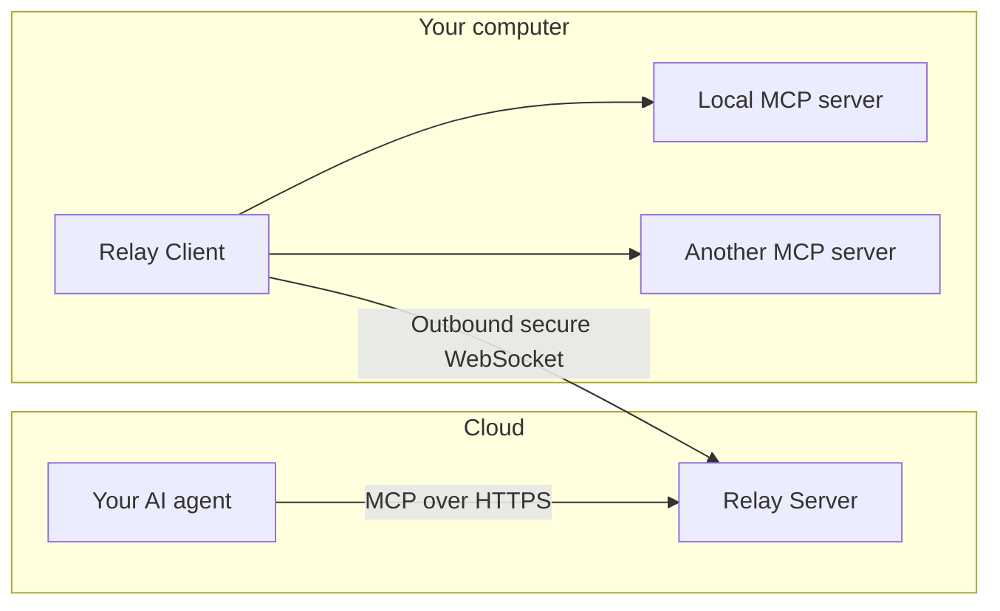

<div align="center">

# MCP Relay

### Your AI in the cloud. Your MCP servers on your computer.

Connect your cloud AI agent to the local MCP servers you choose,
through a single remote endpoint.

**Windows, macOS & Linux · Outbound connection · Your choice of MCP servers**

[](https://github.com/kxlion/mcp-relay/actions/workflows/ci.yml)
[](https://pypi.org/project/mcp-relay/)
[](https://github.com/kxlion/mcp-relay/pkgs/container/mcp-relay)
[](https://github.com/kxlion/mcp-relay/blob/main/LICENSE)
[](https://github.com/kxlion/mcp-relay/blob/main/pyproject.toml)

[How it works](#how-it-works) · [Get started](#get-started) · [Why MCP Relay?](#why-mcp-relay) · [Guides](#guides)


<sub>A real local run: Server, Client and a small stdio MCP server on one machine,
called from a Python MCP client.</sub>

</div>

## Your local MCP tools, available to your cloud AI

- **No inbound port.** The Client on your computer connects out to the cloud
  Server and reconnects on its own after a network drop.
- **One endpoint for all your servers.** Each local MCP server, `stdio` or
  Streamable HTTP, is published under a name you choose.
- **Native tools.** Your servers' tools appear directly in your AI's tool list
  as `<alias>_<tool>`, such as `localtools_read_file`, and update when servers
  start, stop or change.
- **You decide what is exposed.** Publish only the tools you allow per server;
  remote server management stays off unless you turn it on.

> **Alpha:** one Server, one Client, one user. Configuration and the
> Server/Client contract may change between releases; see the
> [release notes](https://github.com/kxlion/mcp-relay/releases).

## How it works



Your AI agent calls one MCP endpoint on **Relay Server**. **Relay Client**, on
your computer, carries each call to the right local MCP server and returns the
result. The built-in `relay_status` tool reports the state of the whole chain.

## Get started

You need a cloud AI agent that supports MCP over Streamable HTTP with an
Authorization header, a cloud host reachable over HTTPS (a TLS reverse proxy or
a secure tunnel), and your Windows, macOS or Linux computer. MCP Relay does not
provide hosting, DNS or TLS.

### 1. Install

On the cloud host and on your computer:

```bash
uv tool install mcp-relay
```

No [uv](https://docs.astral.sh/uv/)? The one-line installer sets it up first:

```bash
# Linux and macOS
curl -fsSL https://raw.githubusercontent.com/kxlion/mcp-relay/main/scripts/install.sh | bash
```

```powershell
# Windows (PowerShell 5.1 or newer)
iex (irm https://raw.githubusercontent.com/kxlion/mcp-relay/main/scripts/install.ps1)
```

To read the installer before running it, or to pin a release, see
[Install and upgrade](https://github.com/kxlion/mcp-relay/blob/main/docs/cli.md#install-and-upgrade).

### 2. Create two tokens

| Token | Shared by |
|---|---|
| `RELAY_CLIENT_TOKEN` | Server and Client |
| `RELAY_MCP_TOKEN` | Server and your AI agent |

Use two different random values of 32–256 printable ASCII characters without
spaces, for example from `openssl rand -hex 32`. Put them in
`~/.mcp-relay/.env` (`%USERPROFILE%\.mcp-relay\.env` on Windows), readable
only by your user. See
[credentials](https://github.com/kxlion/mcp-relay/blob/main/docs/cli.md#prepare-credentials-and-run-setup).

### 3. Start the Server

On the cloud host, run `mcp-relay onboard` and choose
**Server only**. Then route these two addresses through your TLS proxy, keeping
the `Authorization` header and allowing long-lived WebSocket connections:

| Public address | Internal destination |
|---|---|
| `https://relay.example.com/mcp` | `http://127.0.0.1:8000/mcp` |
| `wss://relay.example.com/ws` | `http://127.0.0.1:8001/ws`, with WebSocket Upgrade |

```sh
mcp-relay config validate
mcp-relay server
```

For a proxy on another host or the Docker image, see the
[deployment guide](https://github.com/kxlion/mcp-relay/blob/main/docs/deployment.md).

### 4. Start the Client

On your computer, run `mcp-relay onboard`, choose
**Client connected to a remote Server** and enter your
`wss://relay.example.com/ws` address. MCP Relay bundles no MCP server: declare
the ones you already use in `~/.mcp-relay/config.yaml`:

```yaml
mcp_servers:
  localtools:                   # an MCP server already running over HTTP
    url: http://127.0.0.1:9000/mcp
  browser:                      # a stdio MCP server launched by the Client
    command: [npx, "@example/browser-mcp"]  # placeholder package
    tools:                      # optional: publish only these tools
      navigate:
      screenshot:
        description: Capture the current page as a PNG.
```

```sh
mcp-relay config validate
mcp-relay client
```

Restart the Client after editing `config.yaml`.

### 5. Connect your AI agent

| Setting | Value |
|---|---|
| Transport | Streamable HTTP |
| URL | `https://relay.example.com/mcp` |
| Header | `Authorization: Bearer <RELAY_MCP_TOKEN>`, kept in your agent's secret settings |

Then ask it:

> Call `relay_status` and tell me which MCP servers and tools are available on
> my computer.

A `live` Client and your servers listed as `running` confirm the whole chain
works. If not:

| Symptom | Check |
|---|---|
| `mcp-relay`: command not found | Open a new terminal to pick up the updated `PATH` |
| Your AI gets `401` or cannot reach `/mcp` | The `RELAY_MCP_TOKEN` value and the proxy route to port 8000 |
| `client_unavailable` | The Client is running, with the same `RELAY_CLIENT_TOKEN` as the Server, and `/ws` reaches port 8001 |
| A server is missing or `unavailable` | Its `error` in `relay_status`, and `client.log` next to your configuration |

`mcp-relay config show` prints the effective settings with secrets redacted.
More in [troubleshooting](https://github.com/kxlion/mcp-relay/blob/main/docs/cli.md#troubleshooting).

Want to try it first without a cloud host? Choose **Local Server + Client**
during onboarding; see
[one computer](https://github.com/kxlion/mcp-relay/blob/main/docs/deployment.md#run-everything-on-one-computer).

## Why MCP Relay?

| You want to... | With a plain tunnel | With MCP Relay |
|---|---|---|
| Expose several MCP servers | One public URL and one auth setup per server | One endpoint; each server published under its own alias |
| Use `stdio` MCP servers | Needs a separate stdio-to-HTTP bridge | Launched and relayed by the local Client |
| Limit what the AI sees | Everything the server offers is exposed | Per-server `tools:` allowlist |
| Know whether your computer is reachable | Guess from timeouts | `relay_status` reports the whole chain |
| Survive network drops | Depends on the tunnel | The Client reconnects and the tool list updates itself |

Tools such as `mcp-remote` solve the opposite problem, connecting a local MCP
client to a remote server.

## Security in brief

- Both tokens stay out of YAML, command arguments and `config show` output.
- The Server listens on loopback by default; keep it behind your TLS proxy.
- Your AI can add, modify, enable, disable or delete server entries only after
  `mcp-relay config set admin true` on your computer.
- MCP Relay relays the servers you configure; what their tools can do depends
  on those servers and their own permissions. Their results are relayed as is.

See the [security policy](https://github.com/kxlion/mcp-relay/blob/main/SECURITY.md)
to report a vulnerability.

## Guides

- [Deploy the cloud Server](https://github.com/kxlion/mcp-relay/blob/main/docs/deployment.md):
  TLS proxy routes, Docker, one-computer setup
- [Run and configure](https://github.com/kxlion/mcp-relay/blob/main/docs/cli.md):
  credentials, settings, logs, troubleshooting, uninstall
- [Tools and server management](https://github.com/kxlion/mcp-relay/blob/main/docs/tools.md):
  server entries, tool naming, administration, errors
- [Protocol reference](https://github.com/kxlion/mcp-relay/blob/main/docs/protocol.md):
  the relay contract and its bounds

Licensed under the [MIT License](https://github.com/kxlion/mcp-relay/blob/main/LICENSE).
