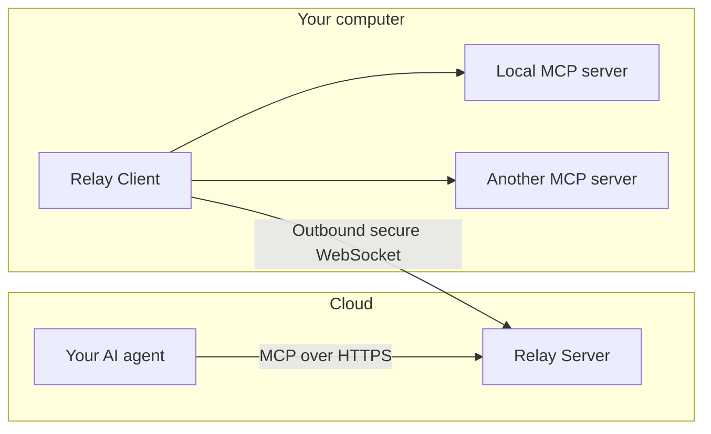

<div align="center">

# MCP Relay

### Your AI in the cloud. Your MCP servers on your computer.

Connect your cloud AI agent to the local MCP servers you choose,
through a single remote endpoint.

**Windows, macOS & Linux · Outbound connection · Your choice of MCP servers**

[](https://github.com/kxlion/mcp-relay/actions/workflows/ci.yml)
[](https://pypi.org/project/mcp-relay/)
[](https://github.com/kxlion/mcp-relay/pkgs/container/mcp-relay)
[](https://github.com/kxlion/mcp-relay/blob/main/LICENSE)
[](https://github.com/kxlion/mcp-relay/blob/main/pyproject.toml)

[Get started](#get-started) · [How it works](#how-it-works) · [Why MCP Relay?](#why-mcp-relay) · [Guides](#guides)


<sub>A real local run: Server, Client and a small stdio MCP server on one machine,
called from a Python MCP client.</sub>

</div>

## Bring your local MCP tools to your cloud AI

Your AI agent runs in the cloud. The MCP servers it needs run on your computer.
MCP Relay connects them: a Server in the cloud receives the agent's requests,
and a local Client relays them to your configured MCP servers.

**No inbound port or port forwarding is needed on your computer.** The local
Client opens the connection to the cloud Server and reconnects automatically
if that connection is interrupted.

MCP Relay works with MCP servers you supply, using `stdio` or Streamable HTTP.
It does not bundle or guarantee any particular server. The actions your AI can
perform depend on the servers you configure and their own permissions.

> **Project status:** alpha. Configuration and the Server/Client contract may
> still change between releases; read the
> [release notes](https://github.com/kxlion/mcp-relay/releases) before
> upgrading. The current setup supports one Relay Server, one Relay Client, one
> user and one computer.

## How it works



- **Your cloud AI agent** connects to one MCP endpoint.
- **Relay Server** routes requests between the AI agent and your computer.
- **Relay Client** connects your local MCP servers under names you choose.

The tools of your local MCP servers appear directly in your AI's tool list,
named `<alias>_<tool>` (for example `localtools_read_file`), and the list
updates itself when servers start, stop or change. `relay_status` reports the
state of the whole chain. You can restrict each server to the tools you want
your AI to see.

You can also let your AI manage the configured servers by explicitly enabling
administration on the local Client. This is optional and disabled unless you
set `admin: true`.

## Why MCP Relay?

| You want to... | With a plain tunnel | With MCP Relay |
|---|---|---|
| Expose several MCP servers | One public URL and one auth setup per server | One endpoint; each server published under its own alias |
| Use `stdio` MCP servers | Needs a separate stdio-to-HTTP bridge | Launched and relayed by the local Client |
| Limit what the AI sees | Everything the server offers is exposed | Per-server `tools:` allowlist |
| Know whether your computer is reachable | Guess from timeouts | `relay_status` reports the whole chain |
| Survive network drops | Depends on the tunnel | The Client reconnects and the tool list updates itself |

MCP Relay still needs a public HTTPS/WSS address for its Server: a cloud host
behind a TLS reverse proxy, or a secure tunnel in front of the Server. Tools
such as `mcp-remote` solve the opposite problem, connecting a local MCP client
to a remote server.

## Get started

You need a cloud AI agent supporting MCP over Streamable HTTP with an
Authorization header, a cloud host for Relay Server, and your Windows, macOS or
Linux computer. For remote access, provide an HTTPS/WSS address through a TLS reverse
proxy or secure tunnel. MCP Relay does not provision hosting, DNS or TLS.

### 1. Install on the cloud host and your computer

MCP Relay is published on [PyPI](https://pypi.org/project/mcp-relay/). With
[uv](https://docs.astral.sh/uv/):

```bash
uv tool install mcp-relay
```

uv downloads Python 3.14 when it is not already available. Upgrade later with
`uv tool upgrade mcp-relay`. To pin a release, for example in a script or CI
job, install `mcp-relay==<version>`.

**Without uv**, the one-line installers set up uv, install the same package from
PyPI for your user account and start guided setup when a terminal is available.

**Linux and macOS** - requires Bash and `curl`:

```bash
curl -fsSL https://raw.githubusercontent.com/kxlion/mcp-relay/main/scripts/install.sh | bash
```

**Windows** - PowerShell 5.1 or newer:

```powershell
iex (irm https://raw.githubusercontent.com/kxlion/mcp-relay/main/scripts/install.ps1)
```

These commands run a remote script that installs the latest release. In the
installer's environment, set `MCP_RELAY_VERSION=<version>` to pin a release and
`MCP_RELAY_SETUP=skip` to skip guided setup.

Guided setup (`mcp-relay onboard`) is covered in steps 3 and 4: choose
**Server-only** on your cloud host and **Client connected to a remote Server**
on your computer, after preparing the credentials below. On the cloud host, you
can run the Server from its Docker image instead; see
[Run the Server with Docker](#3-start-the-cloud-server) in step 3. You can
cancel setup and rerun `mcp-relay onboard` when ready.

<details>
<summary>Inspect the installer before running it</summary>

Linux and macOS:

```bash
curl -fsSL https://raw.githubusercontent.com/kxlion/mcp-relay/main/scripts/install.sh -o install-mcp-relay.sh
less install-mcp-relay.sh
bash install-mcp-relay.sh
```

Windows:

```powershell
irm https://raw.githubusercontent.com/kxlion/mcp-relay/main/scripts/install.ps1 -OutFile .\install-mcp-relay.ps1
Get-Content .\install-mcp-relay.ps1
.\install-mcp-relay.ps1
```

</details>

### 2. Prepare your credentials

Create two different, randomly generated secrets and supply them through process
environment variables or a private `~/.mcp-relay/.env` file:

| Credential | Where to supply it |
|---|---|
| `RELAY_CLIENT_TOKEN` | The cloud Server and your local Client, with the same value |
| `RELAY_MCP_TOKEN` | The cloud Server and your AI agent's MCP connection |

Each token must contain **32–256 printable ASCII characters without spaces**.
Use a secure secret generator; length alone does not make a token secure.
On Windows, the default directory is `%USERPROFILE%\.mcp-relay`.
Restrict the `.env` file to your user account (`0600` on Linux and macOS).

MCP Relay does not generate or save tokens for you. The Client token must be
available before Client onboarding. Keep tokens out of YAML, command arguments
and URLs, and transfer them between machines through a secure channel.

### 3. Start the cloud Server

On the cloud host, run guided setup and select **Server-only**:

```sh
mcp-relay onboard
```

The Server has two separate listeners. With a TLS proxy on the same host,
keep both bound to loopback and route requests as follows:

| Public address (replace the hostname) | Internal destination |
|---|---|
| `https://relay.example.com/mcp` | `http://127.0.0.1:8000/mcp` |
| `wss://relay.example.com/ws` | `http://127.0.0.1:8001/ws` with WebSocket Upgrade |

Keep these internal ports private. The proxy must support long-lived WebSocket
connections and preserve authentication headers. Onboarding configures listener
settings; you configure the proxy separately.

Start the Server:

```sh
mcp-relay config validate
mcp-relay server
```

<details>
<summary>Server listener settings</summary>

These settings belong in the Server environment or private `.env`, not YAML:

```dotenv
RELAY_SERVER_MCP_HOST=127.0.0.1
RELAY_SERVER_MCP_PORT=8000
RELAY_SERVER_CLIENT_HOST=127.0.0.1
RELAY_SERVER_CLIENT_PORT=8001
```

The listener addresses must be distinct. If the proxy is on another host,
choose private bind addresses it can reach and restrict access with a firewall.

</details>

<details>
<summary>Run the Server with Docker</summary>

Each release publishes a Server image for `linux/amd64` and `linux/arm64` on
[GitHub Container Registry](https://github.com/kxlion/mcp-relay/pkgs/container/mcp-relay),
tagged with its full version, its `<major>.<minor>` and `latest`. It needs no
configuration file: put both tokens in a private `.env` file as plain
`KEY=value` lines, then run:

```sh
docker run -d --name mcp-relay --restart unless-stopped --env-file .env \
  -e RELAY_SERVER_MCP_HOST=0.0.0.0 -e RELAY_SERVER_CLIENT_HOST=0.0.0.0 \
  -p 127.0.0.1:8000:8000 -p 127.0.0.1:8001:8001 \
  ghcr.io/kxlion/mcp-relay:latest server
```

Inside the container the listeners bind every interface so that Docker can
forward them; the `127.0.0.1` port mappings keep them reachable only from the
host, for a TLS proxy on the same host. The repository's
[`docker-compose.yml`](https://github.com/kxlion/mcp-relay/blob/main/docker-compose.yml)
runs the same Server but publishes both ports on every host interface: restrict
them with a firewall or change the mappings. The image is for the cloud Server;
run the Client on your computer, next to your MCP servers.

</details>

### 4. Connect your local MCP servers

On your computer, run guided setup and choose **Client connected to a remote
Server**:

```sh
mcp-relay onboard
```

Select Remote and enter your `wss://relay.example.com/ws` address. The Client
reads the `RELAY_CLIENT_TOKEN` you supplied in step 2.

Declare your MCP servers under `mcp_servers` in the generated
`~/.mcp-relay/config.yaml`. For example, if you already run a local Streamable
HTTP MCP server on port 9000, add:

```yaml
mcp_servers:
  localtools:
    url: http://127.0.0.1:9000/mcp
```

Replace that URL with your server's address. For a server launched as a local
process, use `command` with its executable and arguments instead of `url`.
Registry-based declarations use `source`. Add `tools:` to publish only some of
a server's tools. See the [server configuration reference](https://github.com/kxlion/mcp-relay/blob/main/docs/tools.md) for
the entry formats and per-server credentials.

You choose and configure the underlying MCP servers separately; Relay does not
supply browser, desktop or terminal tools of its own.

Start the Client:

```sh
mcp-relay config validate
mcp-relay client
```

Keep the cloud Server and local Client running. Manual YAML edits take effect
after restarting the Client. Use `Ctrl+C` in the corresponding terminal to stop
either process.

### 5. Connect your cloud AI agent

Add an MCP connection to your agent:

| Setting | Value |
|---|---|
| Transport | Streamable HTTP |
| URL | `https://relay.example.com/mcp` with your hostname |
| Authorization header | `Bearer <your RELAY_MCP_TOKEN>` |

Supply the token through your AI host's secret settings. For clients using the
following configuration format and supporting environment interpolation:

```yaml
mcp_servers:
  mcp_relay:
    url: https://relay.example.com/mcp
    headers:
      Authorization: "Bearer ${RELAY_MCP_TOKEN}"
    supports_parallel_tool_calls: false
```

Ask your AI agent to:

> Call `relay_status` and tell me which MCP servers and tools are available on
> my computer.

A `live` Client report confirms the round trip to your computer. Your servers'
tools are then called like any other MCP tool. See the
[tool guide](https://github.com/kxlion/mcp-relay/blob/main/docs/tools.md) for naming, filtering and error handling.

## Choose whether your AI can manage servers

Your configured, enabled servers' tools are always available. Adding,
modifying, deleting, enabling or disabling server entries remotely requires
explicit permission on your local Client:

```sh
mcp-relay config set admin true
```

Restart the Client to apply the change. To lock administration again:

```sh
mcp-relay config unset admin
```

Restart once more. Without it, the administration tools are not listed. This
setting controls server administration, not the actions
of tools exposed by your MCP servers. Configure those servers' permissions
accordingly. Third-party results are relayed without scanning them for secrets.

## Need help?

| Problem | Start here |
|---|---|
| Command not found after installation | Open a new terminal to pick up the updated `PATH` |
| Startup rejects a token | Check the named variable, the 32–256 character requirement and the absence of spaces |
| Cloud AI cannot connect | Check the HTTPS URL, MCP token and proxy route to port 8000 |
| `client_unavailable` | Keep the local Client running; check its token, WSS URL and proxy route to port 8001 |
| A local server is unavailable | Check its launcher or URL, dependencies and credentials; other servers can keep running |
| Administration returns `permission_denied` | Set `admin: true` locally and restart the Client if you want to allow it |

Use `mcp-relay config show` to inspect effective settings with secrets redacted.
Logs are written to `~/.mcp-relay/server.log` and `client.log`.
The [CLI guide](https://github.com/kxlion/mcp-relay/blob/main/docs/cli.md) covers configuration and diagnostics.

<details>
<summary>Can I run everything on one computer?</summary>

Yes. Choose Local Server + Client during onboarding. The MCP endpoint defaults
to `http://127.0.0.1:8000/mcp`, and the Client connects to
`ws://127.0.0.1:8001/ws`. Both tokens are still required. A cloud AI agent cannot
reach your computer through these loopback addresses.

</details>

<details>
<summary>How do I uninstall?</summary>

Stop the Relay processes on the machine, then run:

```sh
uv tool uninstall mcp-relay
```

Your configuration, private `.env` and workspace under `~/.mcp-relay` are
preserved. Data removal is a separate manual step.

</details>

## Guides

[CLI and configuration](https://github.com/kxlion/mcp-relay/blob/main/docs/cli.md) ·
[Tools and server management](https://github.com/kxlion/mcp-relay/blob/main/docs/tools.md) ·
[Security policy](https://github.com/kxlion/mcp-relay/blob/main/SECURITY.md)

Licensed under the [MIT License](https://github.com/kxlion/mcp-relay/blob/main/LICENSE).
