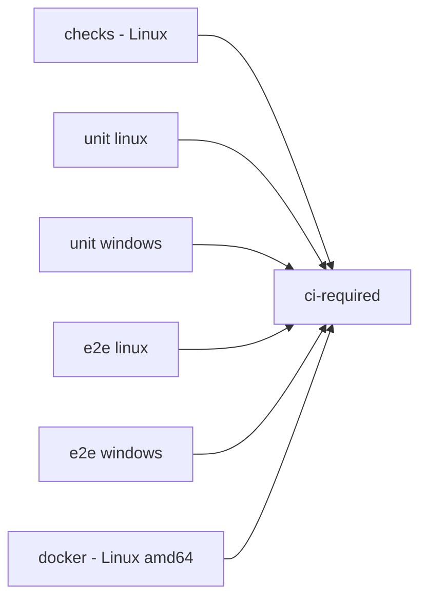

# Continuous integration

[README](../README.md) · [Contributing](../CONTRIBUTING.md) · [Workflow](../.github/workflows/ci.yml)

This reference explains what the repository's automated checks run and how to
read their results. It is for contributors and reviewers; installation and
normal use are covered by the README and [CLI guide](cli.md).

The CI workflow runs for pushes to `main` and pull requests targeting `main`.
It validates changes without publishing packages, creating releases or deploying
infrastructure. Publishing to PyPI and to GitHub Container Registry are separate
workflows, described in [Release to PyPI](#release-to-pypi) and
[Docker image](#docker-image). The one-line installers are also checked against
PyPI, see [Installers](#installers).

## Pipeline



| Job | Runs | What a passing result establishes |
|---|---|---|
| `checks` | Lockfile check, diff whitespace check, Ruff, actionlint, zizmor and shellcheck on Linux | The code, workflows and shell scripts pass these static checks |
| `unit linux`, `unit windows` | Non-integration tests | The unit suite passes on that platform |
| `e2e linux`, `e2e windows` | Installer, installed CLI smoke checks and integration tests | The exercised installation and integration paths pass on that platform |
| `docker` | Builds the Dockerfile for `linux/amd64` and runs the image smoke test | The image builds and its Relay Server starts and authenticates |
| `ci-required` | Aggregate result check | Every job above and every matrix leg succeeded |

All jobs start in parallel. Matrix jobs continue independently when one fails.
The aggregate gate fails if a required result is failed, cancelled, skipped or
absent; only success satisfies it.

Each `unit` job also verifies that its test run did not modify tracked files. A
local working tree with intentional documentation edits will not satisfy that
clean checkout assertion; it is a CI hygiene check, not a command to discard
changes.

## What the E2E bench exercises

Both platforms install MCP Relay from the checked-out commit using the platform
installer, with onboarding and shell-profile changes disabled. The workflow
sets `MCP_RELAY_BIN` to that installed executable and checks its `--help` and
`--version` before running the integration suite.

The [E2E bench](../tests/test_e2e_bench.py) starts real Server and Client
processes in an isolated temporary home. It exercises status, catalog discovery,
server administration and tool execution through the authenticated MCP endpoint.
A pinned filesystem MCP server is a test fixture for a file write/read round
trip. The fixture's package/version constants live in that test file.

The workflow supplies Python 3.14 and Node.js 24. The bench warms an isolated
`npx` cache; missing Node/npx or a failed fixture download is a failure, not a
skip. It checks process cleanup and released listener ports.

This is evidence for the paths and fixture exercised by that run. It is not a
guarantee for arbitrary MCP servers, real user desktops or cloud proxy setups.
No graphical environment, browser or CUA driver is needed.

## Read failures and reports

Start with the first failing job and its test summary. Inspect the matching
JUnit artifact:

| Artifact | File | Retention |
|---|---|---|
| `reports-unit-linux` | `reports/unit.xml` | 7 days |
| `reports-unit-windows` | `reports/unit.xml` | 7 days |
| `reports-e2e-linux` | `reports/integration.xml` | 7 days |
| `reports-e2e-windows` | `reports/integration.xml` | 7 days |

Reports are uploaded after a job finishes even when tests fail, unless the run
is cancelled. A missing report causes the upload step to fail.

Pytest's `-ra` summary lists skips and their reasons. Current conditional cases
include POSIX file mode and owner checks on Windows, Windows `SIGINT`
subprocess delivery, unavailable signal constants, unavailable symbolic-link
support and a missing non-loopback interface for the network-isolation test. A
skipped check is not evidence that its path passed.

Review `ci-required` on the exact commit being merged. Whether GitHub enforces it
through branch protection or rulesets is a repository setting, not established
by this workflow file; do not infer enforcement from the presence of the job.

## Run checks locally

From a checkout with Python 3.14 or newer and `uv`:

```sh
uv sync --locked --group dev
uv lock --check
uv run --frozen ruff check .
git diff --check
uv run --frozen python -m pytest -q -ra -m "not integration"
uv run --frozen python -m pytest -q -ra -m integration
```

When a change touches `.github/` or a shell script, also run the linters of the
`checks` job. They are locked in the `dev` dependency group:

```sh
uv run --frozen actionlint
uv run --frozen zizmor --offline .github
uv run --frozen shellcheck scripts/*.sh .github/scripts/*.sh
```

Run the narrowest relevant tests first while making a change. The integration
suite needs Node/npx and access to download its pinned fixture. Without
`MCP_RELAY_BIN`, the E2E bench uses the checkout; that is not proof of the
installed-command path exercised by CI. Every test runs with an isolated home
directory, so the suite never reads or writes your real `~/.mcp-relay`.

Report the actual command, platform, pass/fail/skip counts and relevant failures.
Local results do not establish the current state of a GitHub Actions run.

## Workflow safeguards

The workflows grant `contents: read` by default and widen it per job only where
needed, with a comment. Actions are pinned to commit SHAs and checkout
credential persistence is disabled. Setup-uv manages dependency caching. A new
push to a pull request cancels that pull request's previous run; each commit on
`main` keeps its own result, and unrelated refs do not share a concurrency
group.

[Dependabot](../.github/dependabot.yml) proposes monthly grouped updates for the
pinned actions (SHA and version comment together) and for `uv.lock`, each only
after a release is a week old. These pull requests go through CI like any other.

The workflow files are the source of truth for job steps, action revisions,
timeouts and artifacts. Keep this guide aligned when those change. Helper
scripts shared by several workflows live in `.github/scripts/`.

## Release to PyPI

The [release workflow](../.github/workflows/release.yml) runs only when a
GitHub release is published. It never runs on pushes or pull requests.

| Job | Runs | What a passing result establishes |
|---|---|---|
| `build` | Checks that the release tag equals `v` + the `pyproject.toml` version and that `ci-required` succeeded on the tagged commit, builds the sdist and wheel, then installs each one in an isolated environment and checks `mcp-relay --version` | The tagged commit passed CI, and both distributions install and report the declared version |
| `publish to PyPI` | Uploads the built files with `uv publish` | PyPI accepted the files for that version |
| `one-line installers` | Runs the [Installers](#installers) workflow for that version | Both one-line installers install the new release from PyPI |

Publishing uses PyPI Trusted Publishing: PyPI trusts the `release.yml`
workflow of this repository in the `pypi` environment, and GitHub issues a
short-lived OIDC token to the `publish` job only. No PyPI token is stored in
the repository or its secrets. The `build` job has read-only permissions, plus
`checks: read` to read the CI result.

To release:

1. Set the new `version` in `pyproject.toml` and merge it to `main`.
2. Wait for `ci-required` to succeed on that commit. The release workflow does
   not rerun the test suite; it refuses a commit whose latest `ci-required`
   run did not succeed.
3. Publish a GitHub release whose tag is `v<version>` on that commit.

A PyPI version cannot be uploaded twice. A failed `build` publishes nothing;
fix the cause and publish a new release. A version already on PyPI can only be
yanked, then superseded by a new version.

## Docker image

The [Docker image workflow](../.github/workflows/docker.yml) runs when a GitHub
release is published, or manually for an existing release tag
(`gh workflow run docker.yml -f tag=v<version>`). It checks out that tag and
fails if the tag does not equal `v` + the `pyproject.toml` version or if
`ci-required` did not succeed on the tagged commit. Its helper scripts come
from the workflow's own commit, so a manual run for an older tag uses the
current smoke test.

| Job | Runs | What a passing result establishes |
|---|---|---|
| `prepare` | Resolves the tag, checks it against the package version and the CI result | The tag names a release of the declared version that passed CI |
| `build amd64`, `build arm64` | One job per architecture, each on a native runner (`ubuntu-24.04`, `ubuntu-24.04-arm`): build, [smoke test](../.github/scripts/docker-smoke.sh), push by digest | That architecture's image reports the release version, starts `mcp-relay server` from environment variables only, answers `401` to an unauthenticated `/mcp` request and `200` to an authenticated `initialize`, and was pushed |
| `publish multi-arch tags` | Combines both digests under `<version>`, `<major>.<minor>` and, for the newest release, `latest` | `ghcr.io/kxlion/mcp-relay` serves both architectures under those tags |

The pushed image is rebuilt from the smoke-test build's cache, so its layers
are the tested ones; only its labels differ. No tag is published unless both
architectures pass. The `latest` tag moves only when the built tag is the
repository's latest release, so rebuilding an older release does not change it.
The smoke test uses single-use random tokens. The jobs push with their own
`GITHUB_TOKEN` (`packages: write`); no registry credential is stored in the
repository. The CI `docker` job runs the same smoke test on every change, for
`linux/amd64` only and without pushing.

## Installers

The [installers workflow](../.github/workflows/installers.yml) runs
`scripts/install.sh` on Ubuntu and `scripts/install.ps1` on Windows the way a
user does, without `MCP_RELAY_PROJECT_ROOT`, so the package comes from PyPI.
Each job passes when the installer reports the expected version as installed.

| Trigger | Installs | Expected version |
|---|---|---|
| Weekly schedule | Latest release | The latest version on PyPI |
| After a PyPI release | `MCP_RELAY_VERSION=<version>` | That release |
| Manual (`gh workflow run installers.yml [-f version=<version>]`) | The given release, or the latest | That release, or the latest on PyPI |

A release can take a few minutes to reach every PyPI mirror, so each job
retries a failed installation for a few minutes before failing. CI's `e2e`
jobs cover the installers against the checkout; this workflow covers the
PyPI path documented in the README.
