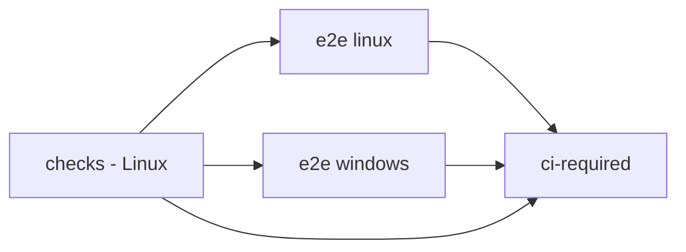

# Continuous integration

[README](../README.md) · [Contributing](../CONTRIBUTING.md) · [Workflow](../.github/workflows/ci.yml)

This reference explains what the repository's automated checks run and how to
read their results. It is for contributors and reviewers; installation and
normal use are covered by the README and [CLI guide](cli.md).

The CI workflow runs for pushes to `main` and pull requests targeting `main`.
It validates changes without publishing packages, creating releases or deploying
infrastructure. Publishing to PyPI is a separate workflow, described in
[Release to PyPI](#release-to-pypi).

## Pipeline



| Job | Runs | What a passing result establishes |
|---|---|---|
| `checks` | Lockfile check, Ruff, diff whitespace check and non-integration tests on Linux | These checks pass for that commit on Linux |
| `e2e linux` | Installer, installed CLI smoke checks and integration tests on Ubuntu | The exercised installation and integration paths pass on Linux |
| `e2e windows` | Installer, installed CLI smoke checks and integration tests on Windows | The exercised installation and integration paths pass on Windows |
| `ci-required` | Aggregate result check | `checks` and the entire E2E matrix succeeded |

The E2E matrix starts only after `checks` succeeds. Matrix jobs continue
independently when one fails. The aggregate gate fails if a required result is
failed, cancelled, skipped or absent; only success satisfies it.

`checks` also verifies that its test run did not modify tracked files. A local
working tree with intentional documentation edits will not satisfy that clean
checkout assertion; it is a CI hygiene check, not a command to discard changes.

## What the E2E bench exercises

Both platforms install MCP Relay from the checked-out commit using the platform
installer, with onboarding and shell-profile changes disabled. The workflow
sets `MCP_RELAY_BIN` to that installed executable and checks its `--help` and
`--version` before running the integration suite.

The [E2E bench](../tests/test_e2e_bench.py) starts real Server and Client
processes in an isolated temporary home. It exercises status, catalog discovery,
server administration and tool execution through the authenticated MCP endpoint.
A pinned filesystem MCP server is a test fixture for a file write/read round
trip. The fixture's package/version constants live in that test file.

The workflow supplies Python 3.14 and Node.js 24. The bench warms an isolated
`npx` cache; missing Node/npx or a failed fixture download is a failure, not a
skip. It checks process cleanup and released listener ports.

This is evidence for the paths and fixture exercised by that run. It is not a
guarantee for arbitrary MCP servers, real user desktops or cloud proxy setups.
No graphical environment, browser or CUA driver is needed.

## Read failures and reports

Start with the first failing job and its test summary. Inspect the matching
JUnit artifact:

| Artifact | File | Retention |
|---|---|---|
| `reports-checks` | `reports/unit.xml` | 7 days |
| `reports-e2e-linux` | `reports/integration.xml` | 7 days |
| `reports-e2e-windows` | `reports/integration.xml` | 7 days |

Reports are uploaded after a job finishes even when tests fail, unless the run
is cancelled. A missing report causes the upload step to fail.

Pytest's `-ra` summary lists skips and their reasons. Current conditional cases
include Windows `SIGINT` subprocess delivery, unavailable signal constants,
unavailable symbolic-link support and a missing non-loopback interface for the
network-isolation test. A skipped check is not evidence that its path passed.

Review `ci-required` on the exact commit being merged. Whether GitHub enforces it
through branch protection or rulesets is a repository setting, not established
by this workflow file; do not infer enforcement from the presence of the job.

## Run checks locally

From a checkout with Python 3.14 or newer and `uv`:

```sh
uv sync --locked --group dev
uv lock --check
uv run --frozen ruff check .
git diff --check
uv run --frozen python -m pytest -q -ra -m "not integration"
uv run --frozen python -m pytest -q -ra -m integration
```

Run the narrowest relevant tests first while making a change. The integration
suite needs Node/npx and access to download its pinned fixture. Without
`MCP_RELAY_BIN`, the E2E bench uses the checkout; that is not proof of the
installed-command path exercised by CI.

The full non-integration suite is run on Linux in CI. Running it on Windows can
expose platform assumptions that the CI integration matrix does not cover.
Report the actual command, platform, pass/fail/skip counts and relevant failures.
Local results do not establish the current state of a GitHub Actions run.

## Workflow safeguards

The workflow grants `contents: read`, pins actions to commit SHAs and disables
checkout credential persistence. Setup-uv manages dependency caching. Superseded
runs on the same pull request or ref are cancelled; unrelated refs do not share
that concurrency group.

The workflow file is the source of truth for job steps, action revisions,
timeouts and artifacts. Keep this guide aligned when those change.

## Release to PyPI

The [release workflow](../.github/workflows/release.yml) runs only when a
GitHub release is published. It never runs on pushes or pull requests.

| Job | Runs | What a passing result establishes |
|---|---|---|
| `build` | Checks that the release tag equals `v` + the `pyproject.toml` version, then builds the sdist and wheel | The tagged commit builds with the declared version |
| `publish to PyPI` | Uploads the built files with `uv publish` | PyPI accepted the files for that version |

Publishing uses PyPI Trusted Publishing: PyPI trusts the `release.yml`
workflow of this repository in the `pypi` environment, and GitHub issues a
short-lived OIDC token to the `publish` job only. No PyPI token is stored in
the repository or its secrets. The `build` job has read-only permissions.

To release:

1. Set the new `version` in `pyproject.toml` and merge it to `main`.
2. Confirm `ci-required` succeeded on that commit. The release workflow does
   not rerun the test suite.
3. Publish a GitHub release whose tag is `v<version>` on that commit.

A PyPI version cannot be uploaded twice. A failed `build` publishes nothing;
fix the cause and publish a new release. A version already on PyPI can only be
yanked, then superseded by a new version.
