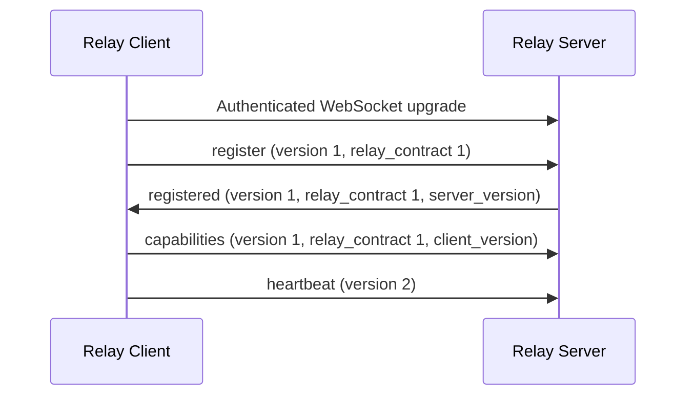

# Protocol reference

[README](../README.md) · [Tools](tools.md) · [CLI](cli.md) · [CI](ci.md)

This page describes the Relay Server–Client wire contract and how it carries MCP
calls. For installation, start with the README; for public tool arguments, use
the tool guide. The protocol is experimental and may change before a stable
release.

## Channels and authentication

```text
Cloud AI -- MCP /mcp --> Relay Server <-- outbound WebSocket /ws -- Relay Client
                                                                     |
                                                           Configured MCP servers
```

| Channel | Default listener | Credential |
|---|---|---|
| AI agent to Relay Server | `127.0.0.1:8000/mcp` | `RELAY_MCP_TOKEN` |
| Relay Client to Relay Server | `127.0.0.1:8001/ws` | `RELAY_CLIENT_TOKEN` |

Each channel requires a single Bearer token. Tokens are operator-supplied,
distinct, and 32–256 printable ASCII characters without spaces. They belong in
the environment or private `.env`, not Client YAML. The two listeners are
configured independently; see [listener settings](cli.md#cloud-server-listeners).

WebSocket authentication occurs before upgrade, registration or dispatch.
At most 32 authenticated sockets may be upgraded concurrently, including sockets
waiting to register. Additional connections are rejected before upgrade (HTTP
403 under Uvicorn). Each upgraded socket has an absolute 10-second deadline to
complete registration. Closing or timing out releases its slot. This bound does
not cover incomplete HTTP request headers.

Remote deployments supply TLS externally: HTTPS for `/mcp` and WSS for `/ws`.
The MCP transport disables the SDK's Host/Origin protection and provides no
application Host/Origin allowlist. Deployment access restrictions belong at the
proxy and network boundary; Bearer authentication is still required.

## Registration and versions

Three version values have different purposes:

| Field | Current meaning |
|---|---|
| Frame `version` | `1` for handshake frames; `2` for application frames |
| `relay_contract` | Mandatory integer `1` on handshake frames |
| `server_version` / `client_version` | Installed package metadata; `unknown` when unavailable |

Package versions do not grant authority. Version metadata is required by the
current frame models and bounded to 64 version-like characters. It is separate
from protocol compatibility.



`register` identifies the Client. `capabilities.tools` announces exactly eight
Relay operations, independent of administration rights:

```text
client.status
mcp.list
mcp.command
mcp.add
mcp.modify
mcp.delete
mcp.enable
mcp.disable
```

Third-party schemas are not part of this announcement. The Server accepts one
connected Client for its configured identity. An incompatible relay contract
closes with code `1002` and reason `protocol_incompatible`; the Client stops
reconnecting until the mismatch is corrected. Deploy compatible Server and
Client versions, then restart the affected processes.

## MCP facade and local sessions

The public facade is a FastMCP 4 server using stateful Streamable HTTP and JSON
responses. It registers the 10 public Relay tools once at startup. Two tools
are Server-local; eight map to the operations above. The full mapping is defined
in [relay_tools.py](../src/mcp_relay/relay_tools.py).

On the local computer, each alias has a dedicated FastMCP client session using
stdio or Streamable HTTP. Sessions use `mode="legacy"` to skip the automatic
`server/discover` probe. FastMCP handles sessions, transport and cancellation.
Relay uses bounded discovery and commands to check local server availability,
not an MCP ping loop. The Server–Client channel has its own heartbeat.

Progress from an executing call is correlated through the Relay request ID and
forwarded to the calling MCP context. Local server log notifications, sampling
and elicitation requests are not relayed. Generic MCP relaying does not imply
support for every optional MCP interaction.

## Invocation

Public tool calls enter through `/mcp`. The Server creates a Relay request ID
and sends one `invoke` frame for a Client-routed operation:

```json
{
  "version": 2,
  "type": "invoke",
  "request_id": "request-1",
  "tool_name": "mcp.list",
  "arguments": {}
}
```

`tool_name` names a Relay operation, not a third-party tool. Relay validates its
closed operation envelope and transport bounds. For `mcp.command`, the Client
checks the catalog revision, alias, inventory, tool and route generation before
forwarding the nested argument object. The target MCP server validates those
arguments against its own tool schema.

Administration envelopes can declare launch commands, endpoints and per-alias
environment values when the local `admin` switch is explicitly true. This is
distinct from execution of an already-discovered tool. See
[server management](tools.md#manage-servers) for those permissions and inputs.

Only one Client invocation may be in flight. Server-local status and registry
search do not allocate a Client invocation. Relay never automatically replays
a third-party command after failure or cancellation.

## Results, errors and progress

A successful result frame carries the provider-compatible result:

```json
{
  "version": 2,
  "type": "result",
  "request_id": "request-1",
  "result": {
    "content": [{"type": "text", "text": "example output"}],
    "structuredContent": {"ok": true},
    "isError": false
  }
}
```

The wire frame's `result` envelope is removed when returning a native MCP
`CallToolResult`. Text, image, audio, embedded resources, resource links,
structured content, metadata and bounded top-level extensions are preserved
within the supported result model. Size, depth, collection, media and URI
validation still applies.

Relay-generated failures use a separate error frame:

```json
{
  "version": 2,
  "type": "error",
  "request_id": "request-1",
  "error": {
    "code": "catalog_stale",
    "message": "catalog revision is stale",
    "execution_state": "not_started"
  }
}
```

`not_started` means the target operation was not sent; `unknown` means its outcome
may be uncertain after dispatch. Neither promises that retrying is safe. Public
error rendering is described in [errors and recovery](tools.md#errors-and-recovery).
Native provider `isError` results remain native results.

A `progress` frame carries `version: 2`, `type: "progress"`, `request_id`, an
integer `progress` from 0 to 100 and an optional message of at most 512 characters.
It is routed to the active MCP call, not treated as a terminal response.

Relay-owned errors and diagnostics are bounded and avoid raw exceptions,
credentials and provider connection details. Third-party content is passed
through without general secret scanning; Relay cannot promise that a provider's
result is free of sensitive data.

## Cancellation and failure isolation

An accepted invocation has one terminal result or error unless cancelled.
A `cancel` frame contains `version: 2`, `type: "cancel"`, the `request_id` and a
reason of 1–256 characters. Cancellation does not require a terminal response;
late result or progress frames are rejected. Cancellation after the calling MCP
session disconnects is best-effort and time-bounded.

A tool refusal, provider error or oversized result does not by itself tear down
the Client WebSocket, MCP session or registry. Subsequent calls use the existing
session. Do not count ordinary tool errors as transport failure. Actual
connection loss follows automatic reconnection; it does not replay the call
whose response was lost.

## Catalog changes

The Client owns the third-party catalog. Discovery returns an opaque
`catalog_revision`, and execution requires that revision. Cursors are signed
and tied to the runtime and snapshot.

A local server's `tools/list_changed` notification invalidates its executable
inventory and triggers a bounded refresh. Other aliases remain isolated.
The public Relay tool list stays fixed; no public tool-list-change notification
is emitted merely because a third-party catalog changed. Call
`relay_mcp_list` again to obtain current state.

## Bounds

Frames are strict UTF-8 JSON objects. Invalid roots, unknown frame fields,
binary frames, unsupported versions and malformed identifiers are rejected.
Provider result extensions are a separate, bounded pass-through surface; they
do not make frame envelopes open-ended.

| Bound | Default |
|---|---|
| General JSON object bytes | 64 KiB |
| General JSON depth / nodes | 16 / 4,096 |
| JSON collection items | 256 |
| Resource URI length | 2,048 characters |
| Whole provider result and individual content-block bytes | 2 MiB |
| Whole provider result nodes | 65,536 |
| WebSocket frame bytes | 4 MiB |
| Request ID length | 128 characters |
| Error / progress message length | 512 characters |

Catalog collections have separate aggregate allowances of 256 KiB and 16,384
nodes; individual descriptors retain their own bounds. The executable source is
[json_bounds.py](../src/mcp_relay/json_bounds.py).

The result/frame relationship must hold:

```text
MAX_TOOL_RESULT_BYTES + MAX_CLIENT_RESULT_ENVELOPE_BYTES <= MAX_WS_MESSAGE_BYTES
```

The current envelope allowance is 183 bytes, derived from the compact result
frame with a maximum-length request ID. It is not configurable. Result frames
omit absent optional fields. If a serialized frame still exceeds the frame
budget, the Client returns `result_too_large` with the measured frame bound.

### Operator overrides

| Environment variable | Accepted range |
|---|---|
| `RELAY_MAX_TOOL_RESULT_BYTES` | 65,536–16,777,216 bytes |
| `RELAY_MAX_RESULT_NODES` | 1,024–262,144 nodes |
| `RELAY_MAX_WS_MESSAGE_BYTES` | 65,536–33,554,432 bytes |

Supply overrides through the process environment or `.env`; explicit process
values win. Startup validates values and rejects an incoherent result/frame
combination. Effective overrides are logged. Bounds remain enforced at each
stage; changing a limit does not disable validation.

Oversize diagnostics name the relevant bound. Serialized byte counts are exact;
node traversal stops at the first excess node and reports a lower bound such as
"at least 65537 nodes". Heartbeat and reconnect timing remain code constants.

## Implementation references

- [Frame models and parsing](../src/mcp_relay/protocol.py)
- [WebSocket authentication and registration](../src/mcp_relay/ws_server.py)
- [Public tool mapping](../src/mcp_relay/relay_tools.py)
- [MCP facade](../src/mcp_relay/mcp_facade.py)
- [Provider result models](../src/mcp_relay/output_models.py)
- [Result rendering](../src/mcp_relay/mcp_results.py)

The code and its tests define executable behavior. This document describes that
behavior, not a broader compatibility or third-party safety guarantee.
